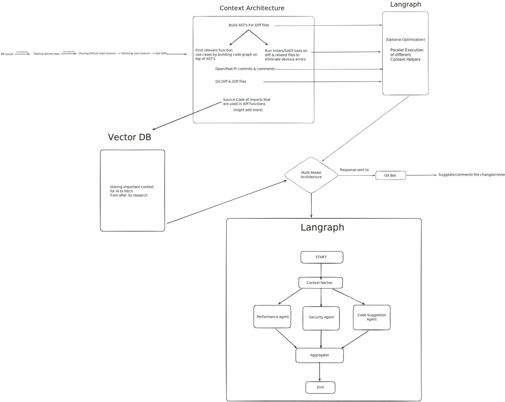
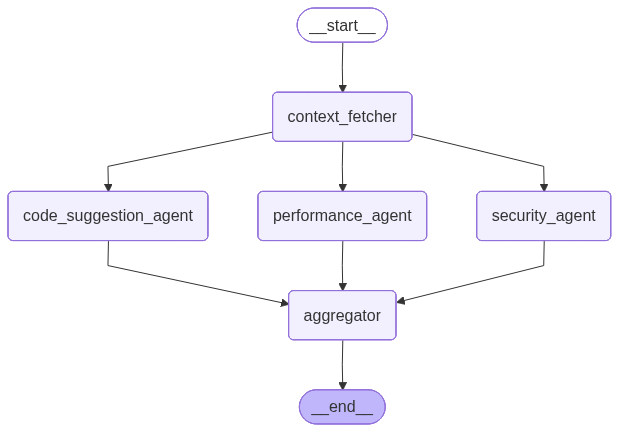

# CodeBoss 🤖

An AI-powered code review system that automatically analyzes pull requests using a sophisticated multi-agent architecture. CodeBoss combines AST parsing, vector databases, and parallel AI agents to provide comprehensive, context-aware code reviews on GitHub.



## 🎯 Overview

CodeBoss is an intelligent GitHub bot that automatically reviews pull requests by leveraging:

- **Multi-Agent AI System**: Specialized agents working in parallel for security, code quality, and performance analysis
- **Vector Database**: Long-term memory for code structure, dependencies, and historical learnings
- **AST Parsing**: Deep code understanding through Abstract Syntax Tree analysis
- **Continuous Learning**: Improves review quality by learning from maintainer feedback

## ✨ Key Features

### 🔍 Intelligent Code Analysis

- **AST-Based Parsing**: Deep semantic understanding of code structure using tree-sitter
- **Multi-Language Support**: Python, JavaScript, TypeScript, Go, and Rust
- **Context-Aware Reviews**: Leverages PR history, commit messages, and related code

### 🧠 Multi-Agent Architecture

- **Parallel Execution**: Three specialized agents analyze code simultaneously
- **Security Agent**: Identifies vulnerabilities, security risks, and unsafe patterns
- **Code Quality Agent**: Reviews best practices, design patterns, and maintainability
- **Performance Agent**: Detects performance bottlenecks and optimization opportunities

### 📊 Vector Database Memory

- **Code Graphs**: Stores AST-parsed functions, classes, and relationships
- **Import Dependencies**: Tracks file dependencies and import patterns
- **Learning System**: Indexes maintainer feedback for continuous improvement

### 🔄 Continuous Learning

- Learns from bot reviews + user feedback
- Incorporates maintainer review patterns
- Improves suggestions over time

## 🏗️ Architecture

### System Architecture

The system follows a webhook-driven architecture:

```
GitHub PR Event → Webhook → Clone Repo → Parse AST → Index to Vector DB
                                              ↓              ↓
                                    Multi-Agent Review   [Qdrant]
                                              ↓         (3 Collections)
                          Context Fetcher ←──────────────┘
                                 ↓
                    ┌────────────┼────────────┐
                    ↓            ↓            ↓
            Security Agent  Code Quality  Performance
                                Agent         Agent
                    ↓            ↓            ↓
                    └────────────┼────────────┘
                                 ↓
                          Aggregator Agent
                                 ↓
                     Post Review to GitHub
                                 ↓
                    Index Learning to Vector DB
```

### Multi-Agent Workflow



The review process uses **LangGraph** to orchestrate agents:

1. **Context Fetcher Agent** (Entry Point)

   - Retrieves relevant code from vector database
   - Fetches related functions, classes, and imports
   - Gathers historical learnings

2. **Parallel Analysis** (Fan-Out)

   - Security Agent: Scans for vulnerabilities, injection risks, unsafe operations
   - Code Quality Agent: Checks best practices, design patterns, code smells
   - Performance Agent: Identifies bottlenecks, memory leaks, inefficient algorithms

3. **Aggregator Agent** (Fan-In)
   - Combines all agent outputs
   - Generates final review with inline comments
   - Prioritizes critical issues

### Vector Database Collections

CodeBoss uses **Qdrant** with three specialized collections:

| Collection     | Purpose              | Content                                     |
| -------------- | -------------------- | ------------------------------------------- |
| `code_graphs`  | Code Structure       | Functions, classes, relationships from AST  |
| `import_files` | Dependencies         | Source code with import/dependency tracking |
| `learnings`    | Historical Knowledge | Bot reviews + maintainer feedback patterns  |

## 🛠️ Technology Stack

### Backend

| Category            | Technologies                           |
| ------------------- | -------------------------------------- |
| **Framework**       | FastAPI, Uvicorn                       |
| **AI/ML**           | LangGraph, LangChain, Google Gemini    |
| **Code Analysis**   | tree-sitter (Python, JS, TS, Go, Rust) |
| **Vector Database** | Qdrant                                 |
| **Embedding Model** | google's/text-embedding-004            |
| **Package Manager** | uv (ultra-fast Python package manager) |

### Frontend

| Category       | Technologies         |
| -------------- | -------------------- |
| **Framework**  | Next.js 15, React 19 |
| **Styling**    | Tailwind CSS 4       |
| **Animations** | Framer Motion        |
| **Language**   | TypeScript           |

## 🚀 How It Works

### 1. Webhook Reception

```python
# Receives GitHub webhook on PR events (opened, synchronize, reopened)
POST /api/webhook
```

### 2. Repository Processing

- Clones repository to temporary directory
- Checks out PR branches (base and head)
- Extracts diff between branches

### 3. AST Parsing & Indexing

```python
# For each changed .py file:
tree = parser.parse_file(file_path)
graph = build_simple_graph(tree, source_code, language, file_path)

# Index to Qdrant
vector_indexer.index_code_graph(file_path, graph)
vector_indexer.index_import_file(file_path, source_code, imports)
```

### 4. Context Building

- Fetches PR history (commits, comments, reviews)
- Builds comprehensive context from:
  - Git diff
  - Commit messages
  - PR description
  - Related code from vector DB
  - Historical learnings

### 5. Multi-Agent Review

```python
# LangGraph orchestrates parallel agent execution
result = await agent_graph.ainvoke({
    "pr_data": pr_data,
    "diff_data": diff_data,
    "comprehensive_context": context
})
```

**Agent Flow**:

```
START → Context Fetcher → [Security, Code Quality, Performance] → Aggregator → END
```

### 6. Learning Indexing

After reviews, CodeBoss indexes:

- Bot reviews with user replies (direct feedback)
- Maintainer reviews (expert patterns)
- Combined bot + maintainer context

This creates a feedback loop for continuous improvement.

### 7. GitHub Integration

Posts review as:

- **Pull Request Review**: With inline comments and suggestions
- **Review Event**: `REQUEST_CHANGES` (if issues found) or `COMMENT`

## 📦 Setup & Installation

### Prerequisites

- Python 3.11+
- Node.js 20+
- Qdrant (vector database)
- GitHub App credentials

### Backend Setup

```bash
# Navigate to backend directory
cd backend

# Install dependencies with uv
uv sync

# Create .env file with required variables
cat > .env << EOF
GITHUB_WEBHOOK_SECRET=your_webhook_secret
GEMINI_API_KEY=your_gemini_api_key
GITHUB_APP_ID=your_app_id
GITHUB_APP_PRIVATE_KEY=your_private_key
GITHUB_APP_SLUG=your_app_slug
QDRANT_URL=http://localhost:6333
EOF

# Start Qdrant (if running locally)
docker run -p 6333:6333 -v $(pwd)/qdrant_storage:/qdrant/storage qdrant/qdrant

# Run the server
uv run python main.py
```

The server will:

1. Initialize Qdrant collections (`code_graphs`, `import_files`, `learnings`)
2. Load embedding model (google's/text-embedding-004)
3. Start FastAPI server on port 8000

**Vector Database Storage**:

- Local storage: Data persists in `qdrant_storage/` directory
- Collections auto-create on first startup with optimized settings
- Embeddings generated via google's/text-embedding-004 model
- Supports both local and cloud Qdrant instances

### Frontend Setup

```bash
# Navigate to frontend directory
cd frontend

# Install dependencies
npm install

# Run development server
npm run dev
```

Access the landing page at `http://localhost:3000`

### Docker Deployment

```bash
# Backend has Docker support
cd backend
docker-compose up -d
```

## 🔧 Configuration

### Environment Variables

**Backend** (`backend/.env`):

```env
# GitHub Integration
GITHUB_WEBHOOK_SECRET=<webhook_secret>
GITHUB_APP_ID=<app_id>
GITHUB_APP_PRIVATE_KEY=<private_key>
GITHUB_APP_SLUG=<app_slug>

# AI APIs
GEMINI_API_KEY=<gemini_key>
ZAI_API_KEY=<zai_key>        # Optional
GROQ_API_KEY=<groq_key>      # Optional

# Vector Database
QDRANT_URL=http://localhost:6333
QDRANT_API_KEY=<api_key>     # If using cloud

# Server
PORT=8000
TEMP_REPO_DIR=./temp_repos
```

### GitHub App Setup

1. Create a GitHub App at `https://github.com/settings/apps/new`
2. Configure webhook URL: `https://your-domain.com/api/webhook`
3. Subscribe to events: `Pull request`
4. Set permissions:
   - **Pull requests**: Read & Write
   - **Contents**: Read
   - **Metadata**: Read
5. Generate private key and add to `.env`

## 📊 Project Structure

```
CodeBoss/
├── backend/
│   ├── main.py                    # FastAPI application entry point
│   ├── pyproject.toml             # Python dependencies
│   ├── docker-compose.yml         # Docker configuration
│   └── src/
│       ├── agents/                # Multi-agent system
│       │   ├── graph.py          # LangGraph workflow definition
│       │   ├── state.py          # Shared state management
│       │   ├── context_fetcher.py
│       │   ├── security_agent.py
│       │   ├── code_quality_agent.py
│       │   ├── performance_agent.py
│       │   └── aggregator.py
│       ├── ai/                    # AI review orchestration
│       │   └── multi_agent_reviewer.py
│       ├── db/                    # Vector database operations
│       │   ├── index.py          # Collection initialization
│       │   ├── vector_indexer.py # Indexing operations
│       │   └── embedding_raw_context.py
│       ├── services/              # Core services
│       │   ├── simple_ast_parser.py      # AST parsing
│       │   ├── simple_context_builder.py # Context assembly
│       │   ├── simple_semantics.py       # Semantic analysis
│       │   ├── vector_retriever.py       # Vector DB queries
│       │   └── history_fetcher.py        # PR history
│       ├── git_ops/               # Git operations
│       │   └── repo_manager.py
│       ├── webhook/               # GitHub webhook handler
│       │   └── github_webhook.py
│       └── utils/                 # Utilities
│           ├── config.py
│           ├── github_bot.py
│           ├── ai_client.py
│           └── qdrant_client.py
└── frontend/
    ├── src/
    │   ├── app/                   # Next.js app router
    │   │   ├── page.tsx          # Landing page
    │   │   └── layout.tsx        # Root layout
    │   ├── components/            # React components
    │   └── Effects/               # Visual effects
    └── public/                    # Static assets & images
```

## 🔄 Development Workflow

### Backend Development

```bash
# Run with auto-reload
cd backend
uv run uvicorn main:app --reload --host 0.0.0.0 --port 8000

# Code formatting
uv run black .

# Linting
uv run ruff check .

# Security scanning
uv run bandit -r src/

# Run tests
uv run pytest
```

### Frontend Development

```bash
cd frontend
npm run dev          # Development server
npm run build        # Production build
npm run lint         # ESLint
```

## 🎯 API Endpoints

| Endpoint               | Method | Description                  |
| ---------------------- | ------ | ---------------------------- |
| `/api/webhook`         | POST   | GitHub webhook receiver      |
| `/api/health`          | GET    | Health check                 |
| `/api/github-app-info` | GET    | GitHub App installation info |

## 🧪 Testing the System

1. Install the GitHub App on a test repository
2. Create a pull request with code changes
3. CodeBoss will automatically:
   - Clone the repository
   - Parse changed files
   - Run multi-agent analysis
   - Post review comments

## 🌟 Why CodeBoss?

### Traditional Code Review Problems

- ⏰ Time-consuming manual reviews
- 🔍 Missing edge cases and security issues
- 📉 Inconsistent review quality
- 🔄 Repetitive feedback on common issues

### CodeBoss Solutions

- ⚡ Instant automated analysis
- 🛡️ Comprehensive security scanning
- 🎯 Consistent, high-quality reviews
- 🧠 Learns from team patterns

Built with ❤️ as part of the Super30 community

---
